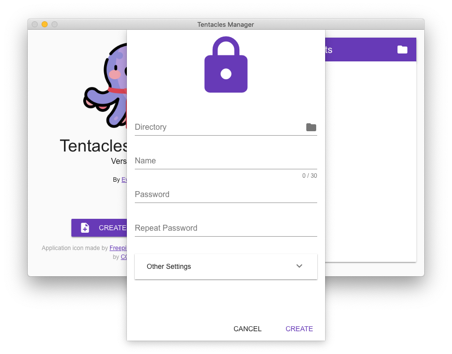
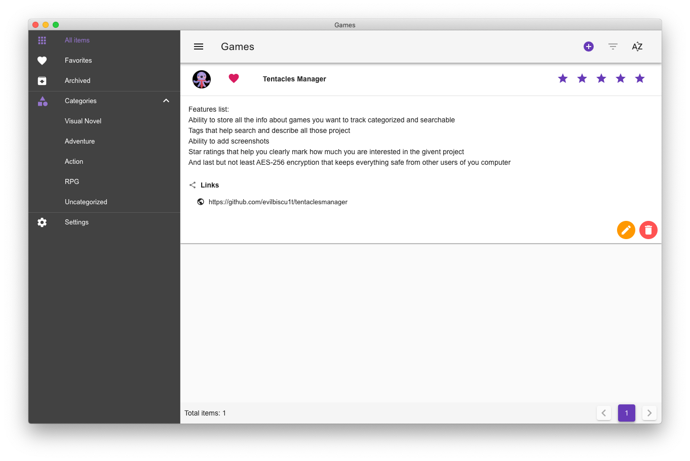
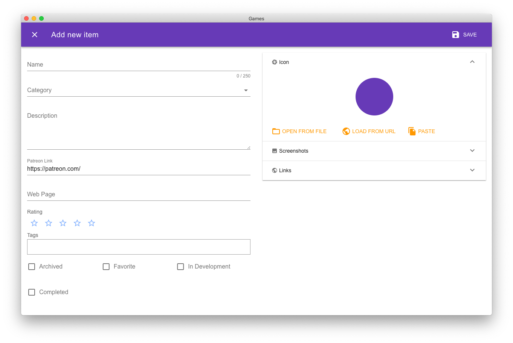
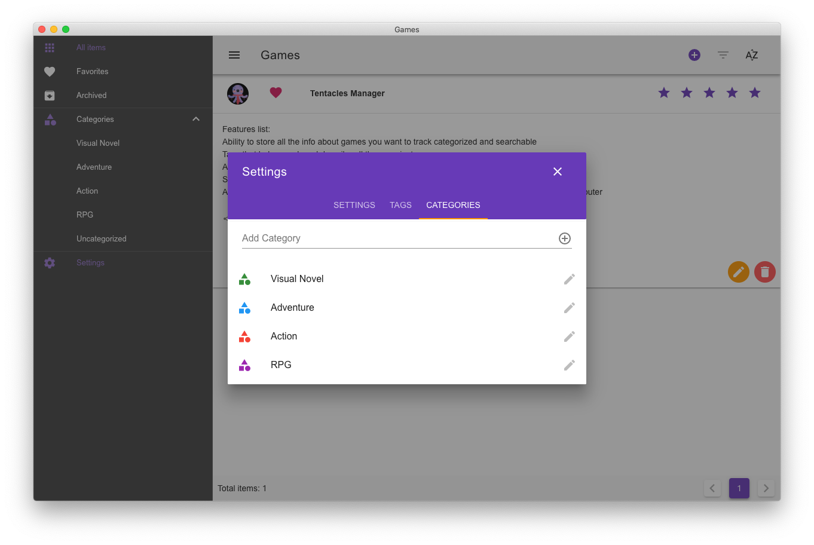
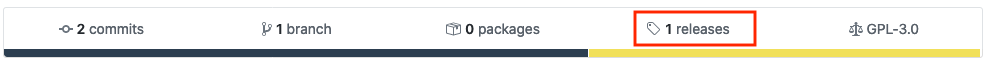

# Tentacles Manager

Personal database for games and other interesting projects out there.
 
 
## Description

Welcome to the Tentacles Manager project. This app was designed as personal database software to easily store information 
about different project being in development that you want to remember about. Nowadays we have so much wonderful games 
(and other projects) that are in development and waiting for support on sites like Patreon that one can quickly lose track 
about all of them. Web browsers bookmarks are clunky and does not give much of a description for items placed in there. 
Notebook applications can be better for saving info about those project, but they require a lot of effort to structure 
everything nicely. If you are like me, and would like to save info about every interesting game (or other project) 
that is in development, in a secure and good-looking app, so that in a year or two you can go back and see what is the 
status of that project, this app is what you are looking for.

### Features list:
* Ability to store all the info about games you want to track categorized and searchable
* Tags that help search and describe all those project
* Ability to add screenshots
* Star ratings that help you clearly mark how much you are interested in the given project
* And last but not least *AES-256 encryption* that keeps everything safe from other users of your computer

## Screenshots

## Download

To download the app just click the [release tab](https://github.com/evilbiscu1t/TentaclesManager/releases) on the top of this GitHub page and choose the correct version for your operating system.

## Compile from source

To compile this application from source you will need NodeJS v10.16.3 (or newer) installed on your system. Once you have it 
just run following commands in your terminal from within the projects main directory:

    npm install
    npm run build
    
This will create an executable file in the `dist` folder that you can use to install Tentacles Manager app in your OS.

If you don't want to compile the application into installation files, and just want to run it directly from sources you
can do that by running following commands:

    npm install
    npm run start
